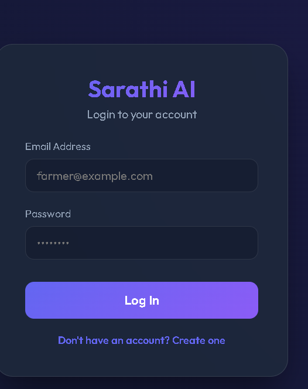
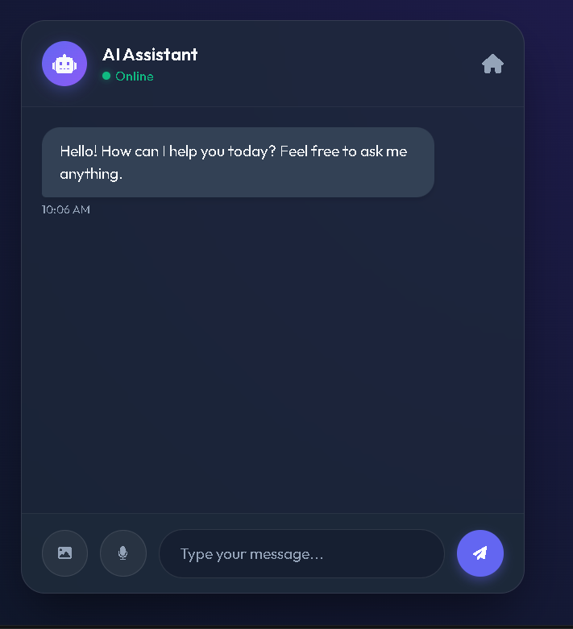
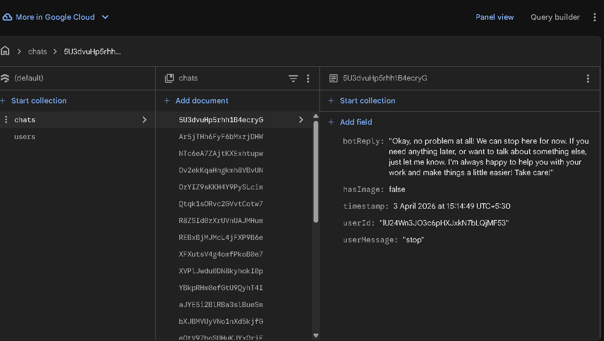
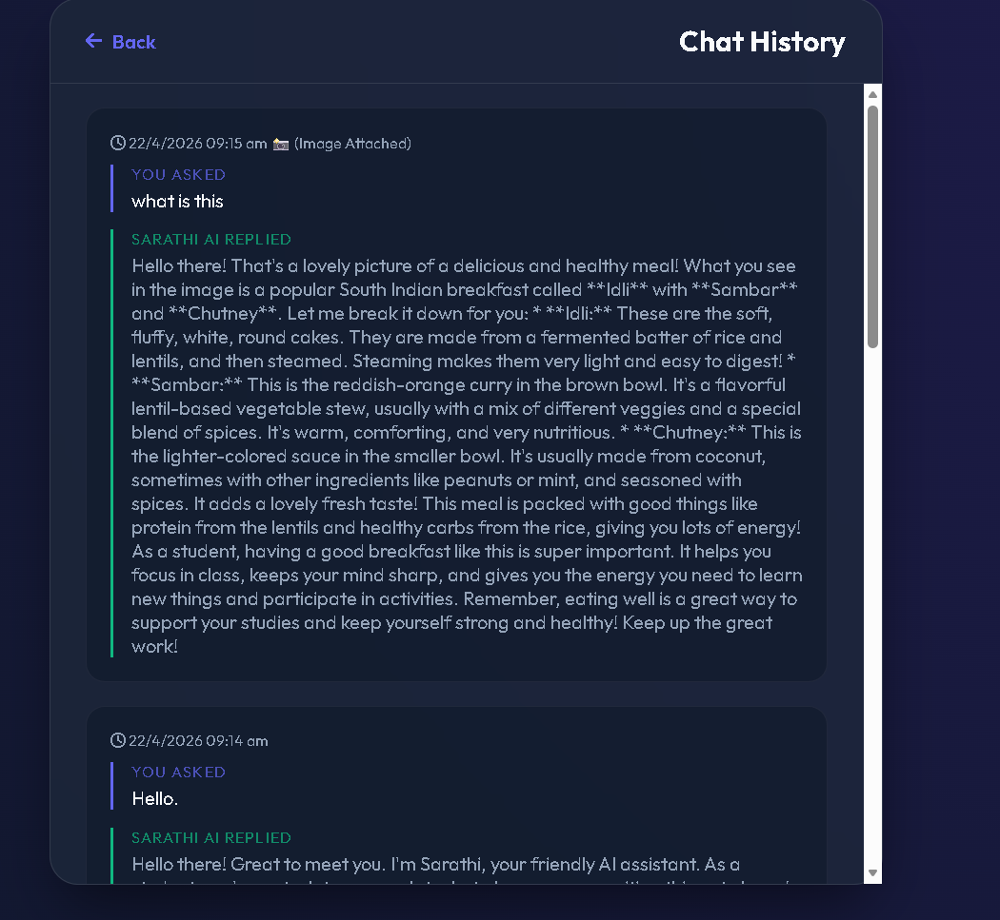

# 🚜 Sarathi AI

### Multilingual Voice-Based AI Assistant for Farmers, Students & Workers

---

## 📌 Overview

**Sarathi AI** is a real-world, AI-powered web application designed to provide personalized assistance using **voice, text, and image inputs**.

It focuses on solving problems for:

- 👨‍🌾 Farmers
- 🎓 Students
- 👷 Daily Workers

through intelligent and multilingual AI support.

---

## ✨ Features

### 🧠 AI-Powered Assistance

- Uses **Google Gemini AI** for real-time responses
- Provides **role-based answers** (Farmer / Student / Worker)

---

### 🌾 Role-Based Personalization

- 👨‍🌾 Farmers → Crop advice, agriculture help
- 🎓 Students → Study guidance, learning tips
- 👷 Workers → Job-related support

---

### 📸 Multimodal Support

- Upload images (crop diseases, documents, etc.)
- AI analyzes **image + text together** for better results

---

### 🗣️ Voice Integration

- 🎤 Speech-to-Text → Ask questions using voice
- 🔊 Text-to-Speech → Bot replies with voice
- Built using **HTML5 Web Speech API (free & fast)**

---

### 🌐 Multilingual Support

Supports:

- English
- Hindi
- Marathi

Automatically adapts based on user preference.

---

### 🔐 Authentication System

- Firebase Authentication
- Secure login/signup
- Persistent sessions

---

### 💾 Cloud Database

- Firebase Firestore
- Stores chat history
- User-specific data

---

### 📱 Responsive UI

- Clean & modern interface
- Mobile + Desktop support
- Designed for rural accessibility

---

## 📸 Screenshots

### 🔐 Login Page



### 💬 Chat Interface



### 📷 Sign In Page


### 📷 Database



### 💬 Chat History



---

## 🛠️ Tech Stack

### 🔹 Frontend

- HTML5
- CSS3 (Responsive UI)
- JavaScript (ES6)
- Web Speech API
- Firebase Web SDK

---

### 🔹 Backend

- Node.js
- Express.js
- REST APIs
- Firebase Admin SDK

---

### 🔹 AI Integration

- Google Gemini API (Gemini 2.5 Flash)

---

### 🔹 Database

- Firebase Firestore

---

## ⚙️ How It Works

```
User (Voice / Text / Image)
        ↓
Frontend (HTML + JS)
        ↓
Backend (Node.js + Express)
        ↓
Gemini AI (Processing)
        ↓
Response + Voice Output
        ↓
Displayed to User
```

---

## 🚀 Getting Started

### 📌 Prerequisites

- Node.js (v18+)
- Firebase Project
- Gemini API Key

---

### 🛠️ Installation

#### 1️⃣ Clone Repository

```bash
git clone https://github.com/Kshitija80/Sarathi-AI.git
cd SarathiAi/backend
```

---

#### 2️⃣ Install Dependencies

```bash
npm install
```

---

#### 3️⃣ Setup Environment Variables

Create `.env` file in `backend/`:

```env
PORT=3000
GEMINI_API_KEY=your_gemini_key_here
```

---

#### 4️⃣ Add Firebase Key

Place:

```
serviceAccountKey.json
```

inside `backend/`

---

#### 5️⃣ Run Backend

```bash
node server.js
```

---

#### 6️⃣ Run Frontend

- Open `frontend/index.html`
  OR
- Use Live Server in VS Code

---

## 💡 Developer Notes

- Uses **HTML5 Web Speech API**:
  - `SpeechRecognition` → Voice input
  - `speechSynthesis` → Voice output

- No external voice API required

- Fast and cost-efficient

---

## 🎯 Future Enhancements

- 🌐 Offline mode for rural areas
- 📍 Location-based suggestions
- 🧠 Smart chat memory
- 🎤 Better Marathi voice support
- 📊 Admin dashboard

---

## 👩‍💻 Author

**Kshitija More**
IT Engineering Student
